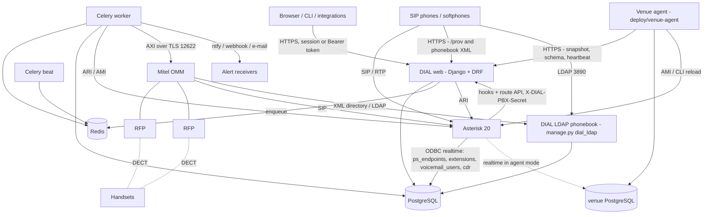
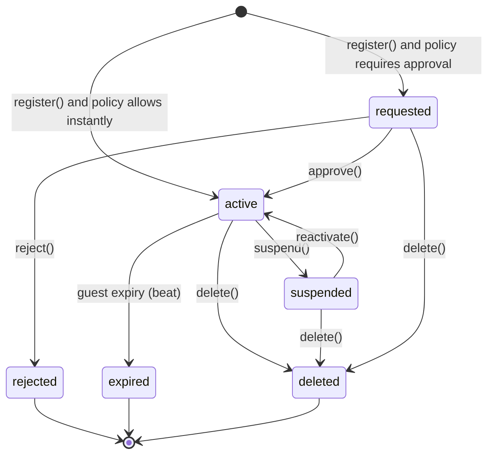
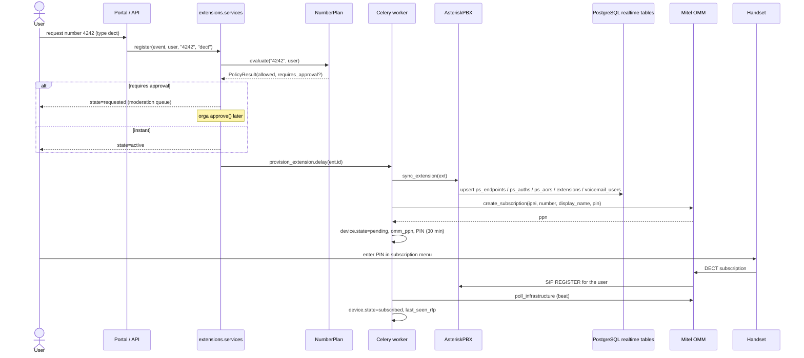
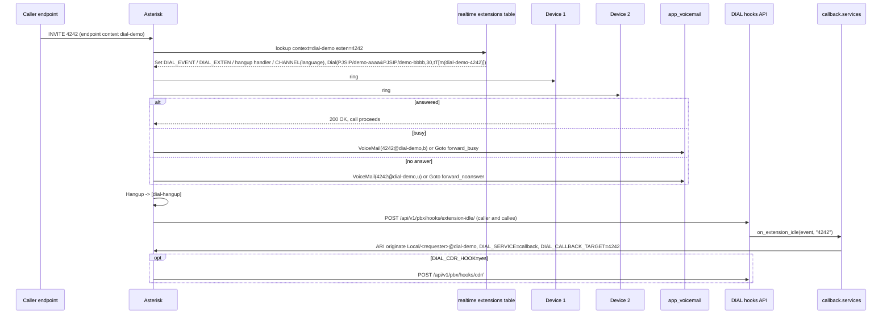
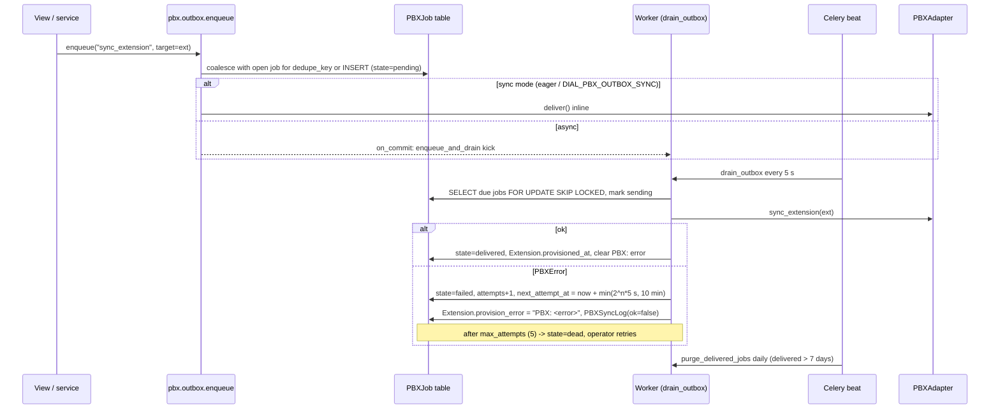
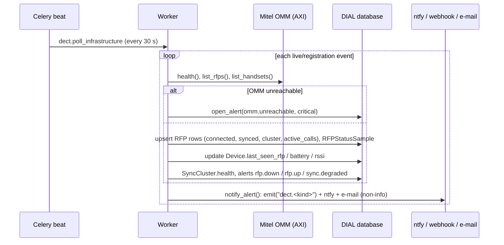

# DIAL Architecture & Data Model

This document describes how DIAL is put together: the domain model, the runtime components, the most
important flows, and the design decisions behind them. For code-level conventions see
[`DEVELOPING.md`](DEVELOPING.md); for the PBX side see
[`../deploy/asterisk/README.md`](../deploy/asterisk/README.md).

## 1. Components



- **web** serves the server-rendered portal (`apps/portal` + per-app UIs under `/e/<slug>/<app>/`,
  including orga-written **info pages** from `apps/pages`), the REST API under `/api/v1/`, the PBX
  hook/route endpoints, the unauthenticated `/prov/` tree (phone provisioning + remote phonebook XML),
  the OpenID Connect login (`apps/accounts/oidc*.py`, plain `requests`, no extra packages) and the venue
  agent endpoints (`/api/v1/pbx/snapshot/`, `/snapshot/schema/`, `/agent/heartbeat/`). It also serves
  the **PWA shell** (`apps/core/views.py`: `/manifest.webmanifest`, the service worker `/sw.js` rendered
  from `static/js/sw.js` with the asset version baked in, and the cacheable `/offline/` page), so the
  portal is installable and a handful of read-only pages survive a dropped uplink.
- **worker** runs provisioning (`provision_extension`), the PBX outbox (`drain_outbox`), ringback tone
  conversion, callbacks, alert fan-out, webhook delivery and e-mail.
- **beat** schedules `dect.poll_infrastructure` (30 s), `callback.dispatch_due_callbacks` (10 s),
  `pbx.drain_outbox` (5 s), `events.apply_scheduled_transitions` (60 s, scheduled lifecycle changes),
  `stats.aggregate_hourly`, `stats.enforce_retention`, `extensions.expire_temporary_extensions`,
  `accounts.purge_email_tokens` (daily), `pbx.purge_delivered_jobs` (daily).
- **ldap** (`manage.py dial_ldap`, `apps/phonebook/ldap/`) is a separate asyncio process: a read-only
  LDAP v3 server with its own BER codec that serves every registration/live event's phonebook below
  `dc=<slug>,dc=dial` from the same database (ORM calls through `sync_to_async`, 30 s entry cache). It
  is the only DIAL process besides web that phones talk to directly.
- **Asterisk** reads its endpoints and dialplan from realtime tables written by `apps/pbx` - either
  DIAL's own PostgreSQL (*shared database*) or, in *agent* mode, a PostgreSQL at the venue that the
  **venue agent** fills from snapshots - and calls back into DIAL for anything dynamic.
- **venue agent** (`deploy/venue-agent/dial_venue_agent.py`, stdlib + psycopg, not a Django process)
  runs next to the venue Asterisk: it polls one event's snapshot over HTTPS, rewrites the local realtime
  tables in one transaction, reloads Asterisk and reports back with a heartbeat that carries the local
  `ps_contacts`. Flow (e) in section 3.
- **OMM** is driven through the `DECTAdapter`; RFPs and handsets are polled and mirrored into DIAL.

## 2. Core data model

```mermaid
erDiagram
    User ||--o{ EventMembership : has
    User ||--o{ Extension : owns
    User ||--o{ Device : owns
    User ||--o{ ServiceAccount : owns
    Event ||--o{ EventMembership : has
    Event ||--o{ UserGroup : defines
    Event ||--|| NumberPlan : has
    Event ||--o{ Extension : contains
    Event ||--o{ Device : contains
    Event ||--o{ RFP : monitors
    Event ||--o{ SyncCluster : has
    Event ||--o{ VenueMap : has
    Event ||--o{ Alert : raises
    Event ||--o{ Webhook : notifies
    Event ||--o{ CallRecord : logs
    Event ||--o{ HourlyStat : aggregates
    Event ||--o{ AuditLog : scopes
    EventMembership }o--o{ UserGroup : member_of
    NumberPlan ||--o{ NumberRange : ranges
    NumberRange }o--o{ UserGroup : allowed_groups
    Extension ||--o{ DeviceBinding : bindings
    Device ||--o{ DeviceBinding : bindings
    Device }o--o| ProvisioningProfile : uses
    Device }o--o| RFP : last_seen_rfp
    RFP }o--o| SyncCluster : cluster
    RFP }o--o| VenueMap : placed_on
    Alert }o--o| RFP : about
    Extension ||--o{ CallbackRequest : requester
    Extension ||--o{ CallbackRequest : target
    Extension ||--o{ ScheduledCall : wakeups
    Extension ||--o| CallGroup : is_group
    CallGroup ||--o{ GroupMember : members
    Extension ||--o{ GroupMember : member_ext
    Extension ||--o| Mailbox : mailbox
    Mailbox ||--o{ Message : messages
    Extension ||--o{ CallRecord : src_or_dst
    Extension }o--o| Extension : ported_from
    Extension }o--o| Extension : forward_target
    Event ||--o{ ExtensionPool : random_pools
    Event ||--o{ ExtensionClaim : reserves
    ExtensionClaim }o--o| User : claimant
    ExtensionClaim }o--o| Extension : redeemed_as
    CallGroup }o--o{ User : admins
    CallGroup ||--o{ CallGroupInvite : invites
    Extension ||--o{ CallGroupInvite : invited_ext
    Device }o--o| DECTManufacturer : emc_lookup
    Event ||--o{ PBXJob : outbox
    Event ||--o{ InfoPage : publishes
    InfoPage }o--o| User : updated_by
    User ||--o{ RegistrationEmailToken : email_tokens
    Event ||--o| PhonebookSettings : phonebook_settings
    Event ||--o| PBXConnection : pbx_connection

    User {
        uuid id
        string email
        string username
        bool is_staff
        bool email_verified
        string oidc_subject
    }
    Event {
        uuid id
        string slug
        string state
        date start_date
        date end_date
        string timezone
        datetime registration_opens_at
        datetime goes_live_at
        datetime archives_at
        int max_extensions_per_user
        bool cdr_aggregate_only
        bool has_gsm
        string gsm_trunk
    }
    EventMembership {
        string role
    }
    UserGroup {
        string slug
        string join_code
    }
    NumberPlan {
        int min_length
        int max_length
        bool prefix_free
        string test_ringback_number
        string voicemail_number
        string dect_claim_number
        string announcement_record_number
        json emergency_numbers
        string callback_request_code
        string forward_set_code
        string forward_clear_code
        string forward_busy_code
        string forward_noanswer_code
    }
    NumberRange {
        string prefix
        string pattern
        string mode
        int priority
        json allowed_roles
        bool is_vanity
        int quota_per_user
    }
    Extension {
        uuid id
        string number
        string type
        string state
        string display_name
        bool in_phonebook
        string ring_strategy
        string forward_busy
        string forward_mode
        int forward_delay
        bool call_waiting
        string callerid_display
        bool dect_encryption
        string language
        file ringback_tone
        string ringback_tone_status
        int priority
        bool is_temporary
        string dect_claim_code
        string announcement_record_code
        json config
    }
    InfoPage {
        string slug
        string title
        text body
        int order
        bool published
        bool show_on_dashboard
    }
    Device {
        uuid id
        string type
        string state
        string ipei
        string uak
        string subscription_pin
        string omm_ppn
        string sip_username
        string sip_password
        string mac_address
        string provisioning_token
        string imsi
        string msisdn
        string gsm_register_token
    }
    DeviceBinding {
        int priority
        int ring_delay
        bool is_active
    }
    ProvisioningProfile {
        string vendor
        text template
        string filename_pattern
    }
    ExtensionPool {
        string name
        string prefix
        int length
        bool is_active
    }
    ExtensionClaim {
        string number
        string type
        string email
        string token
        datetime valid_until
    }
    DECTManufacturer {
        string emc
        string name
        string source
    }
    CallGroupInvite {
        string reason
        datetime responded_at
        bool accepted
    }
    PBXJob {
        uuid id
        string kind
        string target_type
        string target_id
        json payload
        string state
        int attempts
        int max_attempts
        datetime next_attempt_at
        string dedupe_key
        text last_error
    }
    RegistrationEmailToken {
        string email
        string token_hash
        string purpose
        string new_email
        datetime expires_at
    }
    PhonebookSettings {
        text intro_text
        json categories
        string directory_token
        bool directory_enabled
    }
    PBXConnection {
        string backend
        string provisioning
        int agent_poll_interval
        datetime agent_last_seen
        string agent_version
        string agent_host
        string agent_software
        bool agent_asterisk_ok
        string agent_message
        string ari_url
        string hook_secret
    }
    RFP {
        string omm_id
        string name
        bool connected
        bool synced
        float pos_x
        float pos_y
    }
    SyncCluster {
        string cluster_id
        string name
    }
    VenueMap {
        string name
        image image
        int width
        int height
    }
    Alert {
        string severity
        string kind
        string message
        datetime resolved_at
    }
    CallbackRequest {
        string kind
        string state
        datetime expires_at
        int attempts
    }
    ScheduledCall {
        datetime scheduled_for
        string repeat
        int max_retries
        string state
    }
    CallGroup {
        string strategy
        int ring_timeout
        string shortcode
    }
    GroupMember {
        bool logged_in
        int priority
        int delay_s
    }
    Mailbox {
        string pin
        bool email_delivery
    }
    Message {
        string caller_number
        int duration_seconds
        bool is_read
    }
    CallRecord {
        datetime started_at
        string src_number
        string dst_number
        int billsec
        string disposition
        string uniqueid
    }
    HourlyStat {
        datetime hour
        int calls
        int answered
        json by_rfp
    }
    ServiceAccount {
        string token_hash
        string token_prefix
        json scopes
        datetime expires_at
    }
    Webhook {
        string url
        string secret
        json event_types
        bool is_active
    }
    AuditLog {
        string action
        string target_repr
        json changes
        string ip_address
    }
```



### Multi-tenancy

An **Event** is the tenant root. Every tenant-scoped table carries an `event` foreign key
(`Extension.event`, `Device.event`, `RFP.event`, ...). Users are **global** (one account across events);
their relation to an event is an `EventMembership` with a `role` (`user`, `helpdesk`, `orga`, `admin`)
and group memberships (`UserGroup`, e.g. "angels"). Superusers count as orga everywhere. URLs carry the
slug (`/e/<slug>/...`, `?event=<slug>` in the API) and every view/viewset filters on it; there is no
cross-event query path in the portal. Numbers are unique per event, not globally, which is what makes
porting "my 2323 from last year" possible - and also means **nobody owns a number beyond one event**:
porting is a re-request under the new event's plan, and an `ExtensionClaim` reserves a number within a
single event only. The one deliberate cross-event read is the helpdesk **number history**
(`apps/extensions/history.py::number_history`): it lists every extension that carried a number in the
current event and, only for superusers or staff (orga/admin/helpdesk) of the respective event, in other
events too.

**Event schedule.** `Event.registration_opens_at` / `goes_live_at` / `archives_at` are optional
timestamps validated by `validate_schedule` (lifecycle order, ahead of the current state).
`apps/events/tasks.py::apply_scheduled_transitions` (beat, every 60 s) applies due ones through
`Event.transition()` one lifecycle step at a time (draft → registration → live → archived), with no
actor (system), and clears each timestamp after it was applied, failed or found stale;
`next_scheduled_transition()` feeds the dashboard hint and the API. `clone()` does not copy the schedule.

**Info pages.** `apps/pages` holds `InfoPage` (event, slug, title, Markdown `body`, `order`,
`published`, `show_on_dashboard`, `updated_by`). Bodies are orga-authored, so `apps/pages/rendering.py`
HTML-escapes the text *before* Markdown runs and strips `javascript:` links; blockquotes are not
supported. Pages are audit-logged, emit `page.updated`, and travel with export/import and clone.

**Phonebook settings.** `PhonebookSettings` (one per event, `services.get_settings(event)`) carries the
intro text and categories plus the **remote directory** credentials: `directory_token` (24 url-safe
random bytes, `rotate_directory_token()`) and `directory_enabled`. The token is the only credential a
desk phone or OMM presents - as a path segment of `/e/<slug>/phonebook/remote/<token>/<vendor>.xml`
(`apps/phonebook/remote.py`, compared in constant time) and as the bind password of
`cn=directory,dc=<slug>,dc=dial` on the LDAP server. `export_event` deliberately leaves it out, so an
imported or cloned event gets a fresh secret; the Django admin shows it read-only.

**PBX connection.** `PBXConnection.provisioning` (`shared_db` | `agent`) selects how realtime rows
reach the venue. In agent mode the `agent_*` columns are a heartbeat mailbox written by
`apps/pbx/snapshot.py::apply_heartbeat` without touching `updated_at` (so the cached adapter is not
rebuilt every 15 s): `agent_last_seen`, `agent_version` (applied snapshot hash), `agent_host`,
`agent_software`, `agent_asterisk_ok`, `agent_message`. Two derived properties feed the UI/API/CLI:
`agent_is_stale` (no heartbeat within `AGENT_STALE_FACTOR` = 3 poll intervals) and `agent_behind`
(`agent_version != snapshot_version(event)`). `config()` maps an empty ARI URL to "no ARI" in agent mode
instead of falling back to the server default.

**User.oidc_subject.** The OpenID Connect link is a single string `<issuer>|<sub>` on `User`
(`apps/accounts/oidc.py::subject_key`). It is the primary lookup on every SSO login; an account without
it can be linked once by verified e-mail address (or explicitly from the profile page) and unlinked
again only while the account has a usable password. Nothing else about the identity provider is
stored - no tokens, no refresh tokens; the ID token is kept in the session only for RP-initiated
logout.

### Number plan policy engine

`NumberPlan.evaluate(number, user=, extension_type=)` returns a `PolicyResult`
(`allowed`, `requires_approval`, `reason`, `range`). Evaluation order:

1. digits only;
2. not one of the plan's `emergency_numbers`;
3. not one of the service numbers (test ringback, wake-up, site survey, echo, voicemail);
4. find the first active `NumberRange` that matches, ordered by `priority` (lower first) - a range
   matches by `prefix` and/or regex `pattern` plus optional per-range `min_length`/`max_length`;
5. no range → plan-level length check, then `default_allowed` / `default_requires_approval`;
6. range → length check, `mode` (`open`, `approval`, `restricted`, `blocked`), `allowed_types`,
   and for `restricted` the user's role must be in `allowed_roles` or the user must be in one of
   `allowed_groups` (orga/admin pass when a restricted range names no roles/groups);
7. `is_vanity` or `mode=approval` sets `requires_approval`.

`apps.extensions.services.check_availability()` layers "is it taken" (`is_taken`), **prefix conflicts**,
open **claims** and quotas (`quota_ok`: range `quota_per_user`, then `Event.max_extensions_per_user`) on
top, and `suggest()` proposes alternatives. The same function backs the live checker at
`/api/v1/availability/` (response keys `available`, `taken`, `requires_approval`, `reason`, `range`,
`suggestions`, `conflicts`, `reserved`).

#### Trunk number blocks

`ExtensionType.TRUNK` routes a whole block to a remote PBX. The block is described by the base number
and `Extension.config["block_digits"]` (1-3 trailing wildcard digits; the base must end in that many
zeros - `4700`/2 → `4700–4799`); helpers `block_range`, `covers(number)` and `number_label`
(`4700–4799` in the phonebook). `apps/numbering/blocks.py::evaluate_block` evaluates base and last
number, refuses reserved numbers inside the block and samples ranges that start inside it, and always
returns `requires_approval=True` - so trunk requests land in the queue unless an orga registers them.
`taken_info(..., block_digits=)` checks overlap **both ways** (an existing block covers a requested
single number; a requested block collides with any single number inside). A trunk carries exactly one
SIP device; `apps/pbx/dialplan.py::rows_for_trunk` writes the base exten plus a pattern (`_47XX`) that
`Dial(PJSIP/${EXTEN}@<sip_username>)`, and the route API answers `type: "trunk"` for any covered number.
`check_availability(..., block_digits=)` backs `?type=trunk&block_digits=` on the availability API.

#### Prefix-free rule

With `NumberPlan.prefix_free` (default on) the set of dialable numbers must be **prefix-free**: no
number may be a proper prefix of another. `23` blocks `2323` (and `2323` blocks `23`). The set that
counts includes active/requested extensions, open claims, digit-only service numbers, emergency
numbers and feature codes. The reason is purely telephonic: Asterisk's realtime dialplan can only
consider `23` complete when nothing longer can follow; otherwise every dial of a short number would
incur the inter-digit timeout. The check names the offending number(s) in `Availability.conflicts`
(and in `reason`) so the UI can say "conflicts with 23". Orga may override length rules but never a
prefix conflict - the resulting dialplan would be ambiguous.

#### Random numbers, pools and claims

- `ExtensionPool` (prefix + total length) describes where `random_free_number()` samples from; without
  pools the plan's default length range is used. Every candidate goes through the full availability
  check, so a random number is always instantly registrable for the requesting user.
- `ExtensionClaim` reserves a number for a person (by `user` or `email`) behind a random invite token.
  While open it counts as taken for everybody else (including prefix conflicts); redeeming registers
  the extension with a **policy override** for range mode/approval but never for emergency, service,
  blocked or taken numbers. Claims expire (`valid_until`, default +14 days).

### Extension lifecycle



All transitions live in `apps/extensions/services.py`; they write the audit log, emit webhooks
(`extension.created|approved|rejected|updated|deleted|transferred`) and enqueue
`provision_extension` / `deprovision_extension`. Views never set `state` directly.

**Forwarding** is a self-referential FK (`Extension.forward_target`, `related_name=forwarded_from`)
plus `forward_mode` (`off`, `always`, `delayed`, `busy`, `noanswer`) and `forward_delay`. The service
layer rejects self-targets, non-active targets and loops (walks the chain); when a target leaves the
`active` state (delete / expire / reject) every extension pointing at it has forwarding reset to `off`
with an audit entry. The legacy free-text `forward_busy/noanswer/unconditional` columns remain and are
only consulted when `forward_mode == off`. Users can also set forwarding from the handset: the plan's
`forward_set_code` (`*21<n>`), `forward_busy_code` (`*22<n>`), `forward_noanswer_code` (`*23<n>`) and
`forward_clear_code` (`*20`) are handled by `apps/extensions/feature_codes.py` via the `feature-code` hook.

**Display name** changes are provisioned without a new DECT subscription: `provision_dect_for_extension`
re-pushes the handset's *primary* binding (number + `caller_id_name`) through `update_subscription`, so
a renamed extension shows the new name on the handset while the subscription stays.

**Phone recordings.** `Extension.announcement_record_code` (`issue_record_code()`, one-time) plus the
plan's `announcement_record_number` let owners record an IVR announcement from a handset; the hooks
`announcement-record-start` / `announcement-recorded` call `apps/ivr/services.py::begin_phone_recording`
/ `finish_phone_recording`, which imports the wav from `DIAL_RECORDING_DIR` (a volume shared with
Asterisk) into `MEDIA_ROOT/ivr/<slug>/<number>/` and emits `announcement.recorded`.

**Ringback tones** are two `FileField`s: the upload (`ringback_tone`) and the worker-produced 8 kHz mono
WAV (`ringback_tone_processed`), with `ringback_tone_status` (`none/processing/ready/failed`) and
`ringback_tone_error`. Only a *ready* tone changes the dialplan (Dial option `m(dial-<slug>-<number>)`);
the corresponding music-on-hold class is emitted by `AsteriskPBX.render_musiconhold(event)` and is
static config on the Asterisk side (see [`deploy/asterisk/README.md`](../deploy/asterisk/README.md)).

## 3. Key flows

### (a) Registering an extension and subscribing a DECT handset



If the OMM or PBX call fails, the exception text is stored in `Extension.provision_error` /
`Device.config["provision_error"]` and shown to orga; a later "provision" click or `pbx/resync` retries
idempotently. PBX-side pushes go through the outbox described in section 5 (`PBX: <error>` prefix),
DECT-side errors are written by the provisioning task directly.

### (b) A call to 4242



Rows are generated by `apps/pbx/dialplan.py`; groups, IVR, emergency, federation and breakout numbers
jump into static contexts that ask `GET /api/v1/pbx/route/` for the dial string. Forwarding modes
replace or wrap the `Dial` (`always` → `Goto`, `delayed` → `Dial` with `forward_delay` timeout then
`Goto`, `busy`/`noanswer` → `Goto` in the respective branch). Call groups with ring delays are
expressed as extra `Local/<delay>*<number>@dial-group` legs in `dial_string_waves`, so Asterisk still
issues a single `Dial`. Details in [`../deploy/asterisk/README.md`](../deploy/asterisk/README.md).

### (d) PBX outbox: from an edit to a realtime row



Jobs of kind `sync_*` / `remove_*` for the same target share a `dedupe_key` and are coalesced while
open, so ten quick edits become one push. Stale `sending` rows (worker crash) are reset after 10 min.
Operators watch the queue on the orga dashboard, via `GET /api/v1/pbx/outbox/` /
`POST /api/v1/pbx/outbox/retry/`, `dial pbx outbox`, or the Django admin (*Retry*, *Deliver now*).

### (c) DECT monitoring loop



### (e) Venue agent sync (agent provisioning mode)

```mermaid
sequenceDiagram
    participant A as Venue agent (venue box)
    participant W as DIAL web
    participant DB as DIAL database
    participant V as venue PostgreSQL
    participant AST as venue Asterisk

    A->>W: GET /api/v1/pbx/snapshot/schema/?event=slug (X-DIAL-PBX-Secret)
    W-->>A: CREATE TABLE IF NOT EXISTS ... (venue_schema_sql)
    A->>V: apply DDL (idempotent)
    loop every poll_interval (15 s)
        A->>W: GET /api/v1/pbx/snapshot/?event=slug, If-None-Match: "applied version"
        W->>DB: build_snapshot(): ps_endpoints/auths/aors/ids, extensions, voicemail_users scoped to the event
        alt version unchanged
            W-->>A: 304 Not Modified
        else changed
            W-->>A: 200 {version, poll_interval, tables}, ETag
            A->>V: one transaction: DELETE + INSERT per table, COMMIT
            A->>AST: reload res_pjsip / dialplan / app_voicemail (AMI or CLI)
            A->>A: persist STATE_DIR/last_version + snapshot.json
        end
        A->>V: SELECT ps_contacts (registrations Asterisk wrote locally)
        A->>W: POST /api/v1/pbx/agent/heartbeat/ {version, hostname, asterisk_ok, message, contacts}
        W->>DB: apply_heartbeat(): agent_* columns, replace_contacts() for the event's endpoints
        W-->>A: {behind: bool}; when behind the agent re-polls after 2 s
    end
    Note over W: outbox delivery calls notify_if_changed(), which emits the webhook pbx.snapshot.changed
```

The snapshot `version` is a hash over the row content with volatile bookkeeping columns removed
(`voicemail_users.stamp`, the surrogate `extensions.id`), so a resync that changes nothing Asterisk
sees yields the same version and a `304`. Row scoping mirrors what `AsteriskPBX` writes: endpoints by
`accountcode` (= slug) or `context` (= `dial-<slug>`), auths/AORs/identifies/contacts through those
endpoint ids, dialplan and mailboxes by context - so one venue database holds exactly one event. The
agent never applies `ps_contacts` or `cdr` from a snapshot (Asterisk owns them locally); contacts flow
*up* in the heartbeat instead, which keeps `extension_status` in DIAL truthful without ARI. Authorization
is the event's hook secret, a service token with scope `pbx:sync`, or an orga session.

## 4. Adapter pattern

| Interface | Reference implementation | Dummy |
|---|---|---|
| `apps/pbx/base.py::PBXAdapter` - `sync_extension`, `remove_extension`, `sync_device`, `remove_device`, `sync_event`, `extension_status`, `active_channels`, `health`, `originate`, `hangup`, `broadcast`, `set_mwi`, `render_dialplan` | `apps/pbx/backends/asterisk.py` (realtime tables + ARI, AMI fallback) | `apps/pbx/backends/dummy.py` |
| `apps/dect/base.py::DECTAdapter` - `health`, `list_rfps`, `list_handsets`, `create_subscription`, `update_subscription`, `delete_subscription`, `open_subscription_window`, `send_message`, `set_mwi` | `apps/dect/backends/omm.py::MitelOMM` (AXI XML over TLS) | `apps/dect/backends/dummy.py` |
| `apps/devices/endpoint_types.py::EndpointType` registry - onboarding description + `dial(device)` | `dect`, `sip`, `webrtc`, `gsm` (per event via `Event.has_gsm`; dials `PJSIP/<msisdn>@<gsm_trunk>`) (+ disabled `analog`) | - |

`get_pbx(event)` / `get_dect(event)` return the adapter for **that event's venue**: an event's
`PBXConnection` / `DECTConnection` row (orga page `/e/<slug>/pbx/`) names a key from `DIAL_PBX_BACKENDS` /
`DIAL_DECT_BACKENDS` and carries the credentials; the adapter is instantiated with `config=` and cached
per event until the row changes. Events without a row - and calls without an event - get the server
default built from `DIAL_PBX_BACKEND` / `DIAL_DECT_BACKEND` and the `ASTERISK` / `OMM` settings
(`lru_cache`d). All adapters accept `config=` (an `ASTERISK`- or `OMM`-shaped dict).
**Adding FreeSWITCH**: implement `PBXAdapter` (e.g. write `directory/` XML or use
`mod_xml_curl` against `render_dialplan`/`route`), keep the hook contracts from `DEVELOPING.md`, add it
to `DIAL_PBX_BACKENDS` (and/or point `DIAL_PBX_BACKEND` at it). **Adding another DECT system** (e.g. a Gigaset N870 or an open OMM clone):
implement `DECTAdapter` returning `RFPInfo` / `HandsetInfo` / `SubscriptionResult`; monitoring, the
coverage map and provisioning work unchanged. **Adding an endpoint class** (GSM, ATA): register an
`EndpointType` with a `dial()` string builder and, if needed, extra `Device` config keys.

## 5. Provisioning & consistency

- **DIAL is the source of truth.** Asterisk holds no configuration of its own besides static contexts;
  the OMM's subscriptions are derived from `Device` rows. The one exception is the music-on-hold file
  for custom ringback tones (`dial-moh.conf`), which is rendered by DIAL but written by the operator.
- **Durable outbox, not fire-and-forget.** Every adapter call (`sync_*`, `remove_*`, `set_mwi`,
  `originate`, `broadcast`) is a `PBXJob` row (`apps/pbx/outbox.py`, GURU3 "WireMessage" style). The
  worker delivers it on commit and every 5 s from beat with exponential backoff (5 attempts, then
  `dead`); an unreachable PBX therefore never loses an edit and never blocks a web request. Flow (d) in
  section 3.
- **Idempotent sync.** `sync_extension` / `sync_device` upsert by primary key (`ps_endpoints.id =
  sip_username`, `extensions (context, exten, priority)`); `sync_event` rewrites the whole event and
  is what the orga "Resync PBX" button and `POST /api/v1/pbx/resync/` call. Every push is logged in
  `PBXSyncLog` (failed outbox attempts included).
- **Error capture, not crashes.** Provisioning tasks catch adapter exceptions into
  `provision_error` fields (`PBX: ` prefix for outbox failures); the moderation UI shows them and
  offers a retry.
- **Eventual consistency by polling.** Registration state (`ps_contacts`), handset location and RFP
  status are read back periodically rather than pushed, so a DIAL restart never loses state. In agent
  provisioning mode the same principle applies to configuration: the venue agent polls snapshots and
  reports contacts back, DIAL only nudges via `pbx.snapshot.changed` (flow (e)).

## 6. Privacy

- `Event.cdr_aggregate_only`: CDRs are folded into `HourlyStat` (calls, answered, billsec, by type /
  disposition / RFP, hashed unique callers) and per-number records are not kept.
- `Event.cdr_retention_days` (falls back to `DIAL_CDR_RETENTION_DAYS`, default 30); `stats.enforce_retention`
  deletes old `CallRecord` rows hourly.
- Users can export (`/accounts/profile/export/`, `/api/v1/stats/me/export/`) and delete
  (`/accounts/profile/delete/`, `DELETE /api/v1/stats/me/`) their own data; `gdpr_erasure_requested_at`
  marks accounts for erasure.
- Phonebook is **opt-in per extension** (`in_phonebook`) and only lists active extensions of live/registration events.
- Helpdesk gets "impersonation-lite": read-only lookup of a user's extensions/devices and PIN reissue,
  each action written to `AuditLog` with `action=impersonate`.

## 7. Security

- Passwords hashed with **argon2**; e-mail login. **OpenID Connect** (`apps/accounts/oidc.py`) is the
  authorization-code flow with PKCE (`S256`), `state` and `nonce` kept in the session for 10 minutes; the
  ID token is fetched by DIAL itself from the token endpoint over TLS, so - as OIDC Core §3.1.3.7 permits -
  its signature is **not** verified; instead `iss`, `aud`/`azp`, `exp` (60 s leeway), `iat` and the
  `nonce` are checked and UserInfo claims are only merged when their `sub` agrees. Account linking by
  e-mail address requires the address to be verified (by DIAL or by a trusted `email_verified` claim) so
  an IdP account cannot hijack an unverified DIAL account; auto-created accounts get an unusable password;
  unlinking requires a usable one. Failed callbacks feed the per-IP login lockout. SSO-only mode
  (`DIAL_OIDC_ALLOW_PASSWORD_LOGIN=0`) disables the password form and signup but keeps `/admin/login/`.
- **Directory token** (`PhonebookSettings.directory_token`): one event-wide secret that phones and the
  OMM present because they cannot log in - in the path of the remote phonebook XML URL and as LDAP bind
  password. It is compared in constant time, every failure on the XML route is a plain `404` (no oracle),
  LDAP bind failures are delayed, rotation is one click / one CLI call and is audited, and the token
  never leaves the server in exports or clones. Autoprovisioned phones do not even receive it: they
  fetch `/prov/<device token>/phonebook.xml` with their own per-device token. The LDAP server refuses
  anonymous binds unless `DIAL_LDAP_ALLOW_ANONYMOUS` is set and speaks LDAPS only when started with a
  certificate (no StartTLS).
- **Venue agent credentials**: the snapshot and heartbeat endpoints accept the event's hook secret
  (`X-DIAL-PBX-Secret`), a service token with scope `pbx:sync` (optionally event-bound) or an orga
  session. The snapshot contains the event's SIP passwords, so the secret at the venue is per event and
  revocable on the PBX connection page.
- **E-mail confirmation** (`RegistrationEmailToken`): single-use links for signup, verification and
  address change; only the SHA-256 of the token is stored, TTL `DIAL_EMAIL_TOKEN_TTL_HOURS` (48 h).
  `DIAL_REQUIRE_EMAIL_VERIFICATION=1` makes signup e-mail-first (no account until the click); in both
  modes an already-registered address gets a "you already have an account" mail rather than a
  different response, so the form does not leak whether an address exists. Token mails are limited to
  5 per address and 20 per IP per hour (cache counters, fail-open); e-mail changes always confirm via
  the *new* address and notify the old one.
- **Service worker cache** (`static/js/sw.js`): only an allowlist of read-only pages is ever stored on
  the device (`/`, `/offline/`, `/docs/…`, `/e/<slug>/`, `/e/<slug>/phonebook/`); `/accounts/`, `/admin/`,
  `/api/`, `/prov/`, orga and PBX pages, QR codes, exports, redirects, non-200 and `no-store` responses
  are never cached, and a logout purges the page cache - so a shared or lost phone does not keep SIP
  passwords or orga data in the browser cache.
- `RateLimitMiddleware` (`DIAL_RATE_LIMITS`: login 20/min, register 10/min, availability 120/min per IP)
  plus DRF throttling (anon 60/min, user 600/min).
- Service tokens `dial_...` are stored as SHA-256 hashes (`ServiceAccount.token_hash`), shown once,
  scoped (`<app>:read|write`, `<app>:*`, `*`), optionally event-bound and expiring.
- PBX → DIAL hooks require `X-DIAL-PBX-Secret` (`DIAL_PBX_HOOK_SECRET`, fallback `ASTERISK_ARI_PASSWORD`);
  the GSM core hook `POST /prov/gsm/register/` uses the same secret.
- **Provisioning endpoints** (`/prov/`, `apps/devices/prov_views.py`) are unauthenticated by design
  because phones cannot log in, so the secret moves into the URL: `GET /prov/<token>/<filename>`
  requires the device's random `provisioning_token` *and* the vendor-specific filename. The MAC-based
  route `GET /prov/<vendor>/<mac>.cfg|.xml` additionally demands `?token=` or HTTP Basic
  `sip_username:sip_password` and never serves credentials on the MAC alone (MACs are guessable). The
  URL regex restricts `<vendor>` to known keys so it cannot shadow a token URL; responses are
  `Cache-Control: no-store`, `X-Robots-Tag: noindex`.
- Extension claims and call group invites are addressed by random, unique tokens (redeemable once;
  claims expire at `valid_until`); claims can bypass range policy only, never emergency/service/blocked
  or taken numbers.
- SIP passwords are 24 random characters (`DIAL_SIP_PASSWORD_LENGTH`) and can be rotated per device
  (`/devices/<id>/rotate/`), which re-syncs `ps_auths`.
- Federation peers default to TLS + SRTP; breakout is off per event (`Event.allow_breakout`) and guarded by
  outbound rules (regex, per-call minutes), `BreakoutPermission` daily quotas and `BreakoutUsage` accounting.
- Prod settings enforce secure cookies/HSTS via env; the compose demo is plain HTTP on purpose.

## 8. Offline-first (per venue)

DIAL itself is one permanent, central service under a fixed domain; every event connects its **own**
Asterisk/OMM at the venue (`PBXConnection` / `DECTConnection`, section 4). The DIAL server has no
external runtime dependencies: no CDN assets (WhiteNoise serves static files), no external auth unless
you opt into OIDC, sounds baked into the Asterisk image, ntfy/e-mail optional. The venue side depends on
the link to DIAL to a degree that the **provisioning mode** decides:

| | Shared database (`shared_db`) | Venue agent (`agent`) |
|---|---|---|
| Source of truth at the venue | DIAL's PostgreSQL over the VPN - zero latency, one copy | a local PostgreSQL mirrored from snapshots - poll latency (15 s default) |
| Uplink dead | provisioning freezes **and** registrations fail once Asterisk's cached rows expire | the venue keeps its last snapshot: registration, local calls, forwarding, voicemail, MWI, conferences continue |
| Exposure | database credentials (all events) live at the venue | one event's hook secret lives at the venue |
| Moving parts | none beyond Asterisk | the agent process + venue database |
| Still needs DIAL at call time | hooks and the route API (groups, IVR, feature codes, unknown numbers, breakout, federation) - both modes | same; emergency numbers fall back to `DIAL_EMERGENCY_FALLBACK`; CDRs made offline stay local |

DIAL's worker still reaches ARI/AMI/AXI over the same link for originate, broadcast and DECT polling; in
agent mode ARI is optional and reloads are the agent's job. If a venue must survive losing the link
completely - including the orga UI - run a DIAL copy on site: export the event to JSON
(`/e/<slug>/orga/export/`), import it on the venue box, point the venue Asterisk at that box and resync.

## 9. Design decisions & trade-offs

| Decision | Why | Trade-off |
|---|---|---|
| Server-rendered Django templates instead of an SPA | one codebase, works on weak venue laptops and old browsers, trivially offline | fewer live-updating widgets (we use `data-refresh` polling) |
| Asterisk **realtime tables** instead of generated config files | no reload race, DIAL writes rows transactionally, Asterisk survives DIAL restarts | schema is coupled to Asterisk option names; sorcery is picky about columns |
| Celery **eager** in dev/tests | `make run` needs no Redis/worker; tests are deterministic | dev never exercises broker failure modes |
| **sqlite** in tests, PostgreSQL in prod | fast CI, no service containers for unit tests | JSONField/ordering differences - CI also applies migrations on PostgreSQL |
| Events as **FK-scoped tenants**, not schema-per-tenant | cross-event features (global users, porting, federation directory, one Asterisk) stay simple; one migration path | every query must filter by event; enforced by helpers and tests, not by the database |
| Polling the OMM instead of relying on AXI push events | robust against reconnects and OMM firmware differences | up to 30 s latency on the dashboard |
| Hook/route HTTP API instead of AGI/ARI Stasis for routing | works with any PBX that can do HTTP, calls never block on DIAL (short curl timeouts) | one extra round trip for group/IVR/unknown numbers |
| **Prefix-free** number plans by default | every number dials without inter-digit timeout; the realtime dialplan is never ambiguous | mixed-length plans lose some numbers (`23` and `2323` cannot coexist) |
| **Database outbox** for PBX pushes instead of direct adapter calls / plain Celery retries | survives PBX downtime and worker restarts, coalesces bursts, visible and retryable by operators | extra table and a 5 s beat tick; one more place to look when "nothing happens" |
| Static `dial-moh.conf` for ringback tones instead of realtime MOH | Asterisk's `musiconhold` has no realtime backend; files stay simple to debug | operator has to re-render + `moh reload` when tones change |
| Provisioning secrets in the URL (`/prov/<token>/...`) | hardphones cannot do OAuth; per-device tokens are revocable and never tied to a guessable MAC | the URL itself is a credential and must be treated as such |
| **Venue agent pulls** snapshots; DIAL never pushes to the venue | venues sit behind NAT and flaky uplinks - an inbound connection to the venue is the exception, an outbound HTTPS call the rule; the agent can restart offline from its cached snapshot; DIAL only *nudges* via the `pbx.snapshot.changed` webhook | changes arrive within the poll interval instead of instantly; one more process and a database at the venue; DIAL-initiated calls still need ARI reachability |
| Shared database stays the **default** provisioning mode | zero latency, one source of truth, nothing to deploy for a lab or a single-event box | needs a database connection to the venue and freezes with the uplink - the agent exists for exactly those events |
| One event-wide **directory token** for phones/OMM instead of per-user credentials or IP allow-lists | desk phones and the OMM cannot log in; one secret in a URL / LDAP password is what every vendor supports; provisioned phones still get a per-device path | rotating locks out every manually configured phone at once; the token equals read access to the whole public phonebook |
| **OIDC and LDAP implemented without extra packages** (plain `requests`; own BER/LDAP codec) | keeps the dependency set small and auditable, works offline once configured, no library upgrade treadmill for two small protocol subsets | no ID-token signature verification (compensated by fetching the token over TLS + `iss`/`aud`/`nonce` checks); the LDAP server covers simple bind + search only |
| **Pull instead of push for registration state** in agent mode (contacts ride in the heartbeat) | DIAL cannot read the venue's `ps_contacts` and may not reach ARI; the agent already has both | registration status is up to one poll interval old |

## 10. Extension points

- New feature app: `apps/<name>/{models,services,api,urls}.py`; API auto-mounts under `/api/v1/`, UI under
  `/e/<slug>/<label>/`, gate with `apps.core.features.enabled("<flag>")`.
- New webhook type: add to `Webhook.EVENT_TYPES`, call `emit()` (current list includes
  `callgroup.invited|invite_accepted|invite_declined`, `page.updated` and `announcement.recorded`).
- New feature code handler: write `handle_feature_code(event, caller, code, target) -> bool` in a module
  and add the dotted path to `FEATURE_CODE_MODULES` in `apps/pbx/api.py` (currently
  `apps.callback.services`, `apps.callgroups.services`, `apps.extensions.feature_codes`); the hook calls
  every module until one returns `True`. The code itself is a `NumberPlan` field so orga can change it.
- New PBX job kind: add to `PBXJob.Kind`, dispatch it in `apps/pbx/outbox.py::_call_adapter`, and add
  it to `COALESCED_KINDS` if repeated edits should merge.
- New DECT vendor code: `manage.py dial_dect_vendors` seeds `apps/devices/dect_vendors.py`; users
  suggest, orga curates at `/e/<slug>/devices/manufacturers/`.
- New provisioning vendor: add to `ProvisioningProfile.Vendor`, a builtin template in
  `manage.py dial_provisioning_profiles`, and the filename pattern; the `/prov/` regex picks it up.
- New remote-phonebook format: add a renderer to `RENDERERS` / `VENDORS` in `apps/phonebook/remote.py`
  (it receives `event` and the entries and returns XML); the URL route and `/prov/<token>/phonebook.xml`
  pick it up. LDAP attributes live in `apps/phonebook/ldap/directory.py::person_entry`.
- New service number / feature code: add a field on `NumberPlan`, a row generator in
  `apps/pbx/dialplan.py`, a branch in `[dial-services]` / `[dial-feature]`.
- New alert kind: `apps.dect.services.open_alert(event, kind, severity, message)`.
- Custom OMM firmware quirks: subclass `MitelOMM`, override `_build_*` / `_parse_*`, set `DIAL_DECT_BACKEND`.

## 11. Known limitations / roadmap

- **Venue link dependency**: the per-event PBX/DECT connection covers ARI, AMI, AXI and the hook
  secret. In the default *shared database* mode the venue Asterisk still reads its realtime tables
  (`ps_*`, `extensions`, `voicemail_users`) directly from DIAL's PostgreSQL and works only while the VPN
  is up. The **venue agent** (section 8, flow (e)) removes that dependency for configuration, but not
  for what the dialplan asks DIAL at call time (groups, IVR, feature codes, route lookups) - those still
  fail offline. Calls made offline stay in the venue's local `cdr` table: the CDR hook is
  fire-and-forget and the agent does not forward CDRs yet. DIAL-initiated calls (wake-up, broadcast,
  callbacks) need ARI reachability into the venue in both modes.
- **Venue agent**: one agent serves exactly one event and wipes/rewrites every table on change; the
  snapshot carries SIP passwords, so the hook secret is as sensitive as the database was. Registration
  status and "behind" detection are up to one poll interval old.

- **WebRTC** browser softphone: Asterisk `transport-wss` and endpoint options exist, no UI client yet.
- **GSM** endpoints dial through a PJSIP trunk and SIMs are linked via `POST /prov/gsm/register/`; the
  cell-network side (HLR/MSC configuration) is out of scope. **Analog** is registered but disabled.
- **DECT encryption** and the `uak` re-subscription path are passed to the OMM but unvalidated on
  hardware; the builtin DECT manufacturer list is best-effort.
- Custom ringback tones need `ffmpeg` on the worker for non-WAV uploads, and the MOH class file is
  static (operator step).
- The **Mitel OMM adapter** was written against the AXI reference and verified only partially against
  real hardware; expect to adjust attribute names for your firmware.
- **OIDC login** deliberately skips ID-token signature verification (token fetched directly over TLS,
  `iss`/`aud`/`azp`/`exp`/`iat`/`nonce` checked instead); there is no back-channel or front-channel
  logout, no refresh tokens, e-mail and nickname are not re-synced on later logins, and the discovery
  document is cached for an hour. One identity provider per server. **LDAP login** is not implemented -
  the LDAP code is the *phonebook server*, not an authentication backend.
- **LDAP phonebook server**: simple bind only (no SASL), no StartTLS (LDAPS via `--cert` instead), no
  paging or other controls, `>=`/`<=`/extensible filters never match, a 30 s entry cache
  (`DIAL_LDAP_CACHE_SECONDS`) delays rotations and edits, and anonymous mode exposes every servable
  event. The remote phonebook XML formats follow the vendors' published schemas but, like the
  provisioning templates, have not been verified on every firmware.
- **Trunk blocks** rewrite inbound caller-ID to the block base (`trust_id_inbound=no` on the trunk's
  endpoint): `4711` behind a `4700–4799` trunk calls out as `4700`. Per-number passthrough would need
  `trust_id_inbound=yes` plus a dialplan check that the asserted number lies inside the block.
- **Record by phone**: the custom prompts `dial/record-*` are not shipped (Asterisk core prompts are the
  fallback) and the `record-announcement` dialplan has not been tested against a real Asterisk. The
  recordings directory must be a volume shared between DIAL and Asterisk.
- **Softphone QR provisioning**: the Linphone (`linphone.xml`) and Acrobits (`acrobits.xml`) documents
  follow the published formats but are unverified on the real apps; the generic `sip:` QR is the safe
  fallback.
- **PWA**: no Web Push and no background sync (notifications stay e-mail/webhook/ntfy); iOS installs
  manually via *Add to Home Screen*; offline mode is read-only and limited to pages already visited.
- **Accessibility checker** (`apps/core/a11y.py`) is a heuristic subset of WCAG run against every
  server-rendered page in the test suite - it catches structural problems (labels, headings, landmarks,
  inline handlers, names) but not colour contrast, focus order or screen-reader semantics of custom
  widgets; those were tuned by hand (contrast ≥ 4.5:1 in both themes) and need a manual re-check when
  the theme changes.
- MWI on Asterisk is driven by `app_voicemail` directly; `set_mwi` via ARI is a no-op by design.
- Messaging, IVR/TTS, conferences, federation and breakout are functional scaffolds behind flags and
  have not been exercised at a real event.
