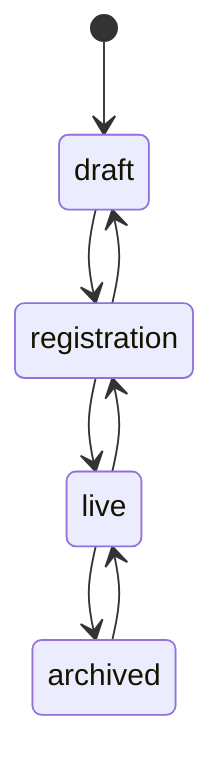

# DIAL Event Guide - creating, staffing and running an event

This guide walks through the whole life of an event in DIAL: from the moment a **global admin** creates
it, through handing out the **orga role per event**, configuring the number plan, opening registration,
running it on site, and archiving or cloning it for next year. It is written for the people who own an
event; the [Operator Handbook](OPERATOR_HANDBOOK.md) covers infrastructure (DECT, SIP, Asterisk,
monitoring) and the [User Guide](USER_GUIDE.md) covers what attendees see.

Paths below are relative to your DIAL server, e.g. `https://dial.example.org/events/new/`. Every orga
page is also reachable from the orange **Orga** groups in the left sidebar of an event, so you rarely
need to type them.

---

## 1. Who may do what

DIAL has exactly one *global* privilege and four *per-event* roles.

| Level | How you get it | Scope |
|---|---|---|
| **Global admin** (Django superuser) | `manage.py createsuperuser`, or another admin ticks *superuser* in `/admin/`. | Whole server. Sees every event (including drafts and private ones), is implicitly *event admin* everywhere, and is the **only one who can create, clone or import events**. |
| **Event admin** | Membership role `admin` on one event. Given automatically to the admin who created the event; can be given to others on the Members page. | One event. Same powers as orga - the separate role exists so you can see who "owns" the event in the member list and the audit log. |
| **Orga / Moderator** | Membership role `orga`, assigned per event on `/e/<slug>/orga/members/`. | One event. Settings, number plan, moderation queue, members & roles, groups, guest numbers, webhooks, API tokens, DECT/GSM infrastructure, statistics, export, state changes. |
| **Helpdesk** | Membership role `helpdesk`, assigned per event. | One event. Everything a user can do plus the helpdesk lookup (find a person by number, e-mail, nickname or IPEI, see their extensions/devices, reissue PINs). No settings, no moderation. |
| **User** | Joins a public event via *Join* on the event page, or is added by orga. | One event. Registers and manages their own extensions and devices. |

Key properties of the model:

- **Roles are per event.** Being orga at *Camp 2025* gives you nothing at *Congress 2025*. The only
  exception is cloning: the new event inherits the orga/admin team of the source (see section 9).
- **Only global admins create events.** The *New event* button, `POST /api/v1/events/`, *Clone* and
  *Import* all check `is_superuser`; an orga gets `403`. This is deliberate: one DIAL server often hosts
  several teams' events, and creating an event is a server-level decision.
- **Orga can promote and demote within their event**, including to `admin`. That is fine because event
  admin and orga have identical rights - nobody can escalate beyond their own event.
- **Nobody can remove themselves** from the member list (so an event never ends up without orga by
  accident). Ask another orga or a global admin.
- Deleting events is not offered in the portal, and `DELETE /api/v1/events/<slug>/` is admin-only.
  Archive instead (section 9); a global admin can still delete via the API or `/admin/` if an event
  was created by mistake.

---

## 2. Before you create an event (server checklist)

Do once per DIAL installation, as global admin:

1. **Admin account** - `docker compose exec web python manage.py createsuperuser` (with
   `DIAL_SEED_DEMO=0`). If the demo seed is on, `admin@dial.local` / `admin` exists; change or delete it
   before anything faces the internet.
2. **Lookup tables** - `manage.py dial_provisioning_profiles` (SIP phone templates) and
   `manage.py dial_dect_vendors` (DECT manufacturer codes). Idempotent.
3. **Mail** - `EMAIL_URL` must deliver, because signup is e-mail-first by default
   (`DIAL_REQUIRE_EMAIL_VERIFICATION=1`): nobody gets an account, and unverified accounts cannot register
   extensions, until they click the link. Test it with your own address.
4. **Feature switches** - `DIAL_FEATURES` decides which modules exist on the DIAL server at all (phonebook,
   callgroups, voicemail, stats, messaging, ivr, conferences, federation, breakout, emergency,
   guest_extensions, waitlist, webhooks). Each event can additionally switch off enabled features for
   itself (section 4), but cannot switch on what the server disabled.
5. **Abuse protection** - defaults are sane (honeypot, login lockout, rate limits). If your team uses a
   corporate domain, consider `DIAL_SIGNUP_ALLOWED_DOMAINS`; see the handbook's *Abuse protection*.
6. **Single sign-on** (optional) - if your organisation has an OpenID Connect provider (Keycloak,
   Authentik, …), set `DIAL_OIDC_*` and run `manage.py dial_oidc_check`; see the handbook's *Single
   sign-on*. Existing accounts link themselves on first SSO login when their e-mail address is verified.
7. **LDAP phonebook** (optional) - desk phones and OMMs that want an LDAP directory need the `ldap`
   compose service (port `3890`) reachable from the venue; XML directories work without it (section 4,
   *Remote directory for phones*).

---

## 3. Creating an event (global admin only)

### In the portal

1. Log in as global admin, open **Events** in the top bar (`/events/`). Only admins see the
   **New event** button.
2. `/events/new/` asks for the minimum:

   | Field | Notes |
   |---|---|
   | Name | Display name, e.g. *Chaos Camp 2027*. Can be changed later. |
   | Slug | URL part: `/e/<slug>/…`. Lowercase, digits, dashes. **Cannot be changed later** (it is in every link, QR code and API path), so pick something short and stable like `camp27`. |
   | Start / end date | Drive *days remaining* on dashboards and the default CDR retention. |
   | Location, timezone | Informational; timezone is used for wake-up calls and statistics. |
   | Public | Public events are listed to everyone and joinable with one click. Private events are invisible to non-members - you add people via the Members page. |

3. Submit. DIAL now:
   - creates the event in state **draft** (invisible to normal users);
   - creates an empty **number plan** (3-5 digit numbers, everything allowed, no ranges yet);
   - makes you **event admin**;
   - writes an audit entry and sends you to the **Number plan** page.

### Via the API or CLI

```
POST /api/v1/events/            {"name": "...", "slug": "...", "start_date": "...", "end_date": "..."}
POST /api/v1/events/<slug>/clone/   {"name": "...", "slug": "...", "start_date": "...", "end_date": "..."}
```

Both need a token of a global admin (`manage.py dial_token <email>` or *API tokens* on your profile).
Everyone else receives `403 Only global admins create events.` The `dial` CLI can list, show, transition
and export events but intentionally has no `create` - use the API call above.

### From last year's event

If a previous event exists on this DIAL server, prefer **Clone** (section 9) over starting from scratch:
it copies settings, branding, number plan with all ranges, user groups and the orga team.

---

## 4. Configuring the event

`/e/<slug>/orga/settings/` (sidebar *Orga · Event → Settings*). Orga and admins can edit everything here.

| Group | Fields | Notes |
|---|---|---|
| Basics | name, description, dates, location, timezone, public | Description and dates show on the event page. |
| Branding | logo, primary colour, accent colour, announcement, default language | The announcement is a free-text (Markdown-free) banner on the event dashboard - use it for "DECT registration opens Thursday" style notices. |
| Dial plan | SIP domain, dial prefix | `sip_domain` is the realm devices register against (e.g. `camp27.dial.local`). `dial_prefix` is only needed for federation with another DIAL. |
| Schedule | registration opens at, goes live at, archives at | Optional timestamps (entered in the event's timezone) at which DIAL changes the state for you - see section 8. Empty = manual transitions only. |
| Quotas | max extensions per user, guest extensions, breakout | Guest extensions unlocks the *Guest numbers* page (section 7). Breakout allows PSTN dialing if the venue PBX has a trunk. |
| GSM | has GSM, GSM trunk | Only if an on-site cell network is connected to the PBX; see handbook §8. |
| Privacy | CDR aggregate-only, CDR retention days | Aggregate-only keeps statistics but no per-call records. Retention empty = follow the server default. |
| Features | disabled features | Tick modules this event does not want (e.g. messaging, conferences). Only features enabled on the DIAL server are listed. |

Save often; every change is audit-logged with a before/after diff (*Orga · Event → Audit log*).

### Info pages

`/e/<slug>/pages/manage/` (sidebar *Orga · Event → Info pages*). Free-form Markdown pages per event -
"How to get a handset", "Rules for trunks", "Who to call when" - that members read under
`/e/<slug>/pages/` (sidebar *Info pages*). Each page has a title, a URL slug, an order, a **published**
flag (unpublished pages are only visible to orga) and **show on dashboard**, which puts the page on the
event dashboard for everyone. Headings, lists, links, tables and code work; raw HTML is escaped and
blockquotes are not supported. Pages are part of the event export/import and of a clone, are
audit-logged and fire the `page.updated` webhook; scripts use `/api/v1/pages/?event=` or
`dial pages list|show --event <slug>`.

### Bulk-loading numbers from CSV

`/e/<slug>/orga/import-csv/` (sidebar *Orga · Numbers → Import CSV*, also linked from *All extensions*).
Use it to load the infodesk, security, medics and infrastructure numbers - or a whole angel list - in one
go instead of registering them one by one. Three steps: **upload** the file, check the **preview**
(every row says what will happen: create, assign to an existing account, create an account, skip with
reason), then **apply**. Rows are applied one at a time, so a bad row never rolls back the good ones.

Columns (download `sample.csv` from the page for a template):
`number,type,display_name,email,username,description,location,in_phonebook,group,role`. `email` names the
owner; with **create accounts** ticked, unknown addresses get a new account with an invitation mail
(they set their password via the link and still have to verify the address before they can register
further numbers themselves). `group` adds the person to a user group, `role` to the member list. Numbers
follow your number plan; the importer runs as orga, so approval steps are skipped - check the preview.
Scripted: `POST /api/v1/extensions/import/?event=<slug>` with `{csv, dry_run, create_users,
allow_ownerless}` or `dial extensions import --event <slug> --file f.csv [--dry-run] [--create-users]`.

### Remote directory for phones

Desk phones and the venue's DECT OMM can show the event phonebook directly on the device - users search
by name on the handset, the phone asks DIAL. The switch and the credentials live on
`/e/<slug>/phonebook/settings/` (*Phonebook → Settings*, orga only), card **Remote directory for
phones**: one XML URL per phone vendor, the LDAP server details and the event's **directory token**.
Because phones cannot log in, that token *is* the password - it sits in every URL and is the LDAP bind
password. Treat the page like the SIP credentials.

- Phones that DIAL autoprovisions (handbook §8) get the directory automatically through their own
  provisioning token; only manually configured phones and the OMM need the URLs or LDAP settings from
  this page. Hand those to whoever configures the venue phones - the vendor-by-vendor recipe is in the
  [Operator Handbook](OPERATOR_HANDBOOK.md) §8 (*Remote phonebook* and *LDAP phonebook*).
- **Rotate the token** (button on the page, `dial phonebook directory --event <slug> --rotate`) when a
  configured phone or the OMM leaves your control, when the URL was pasted somewhere public, or after
  the event if the venue keeps the hardware. Every phone, OMM and LDAP client has to be given the new
  URL / password afterwards, so do it before you roll out phones, not during the event.
- **Remote directory enabled** off switches all of it off at once; the LDAP side additionally only
  serves events in *registration* or *live*.
- The token is never part of an export or clone - a new event starts with a fresh one.

### Connect the venue infrastructure

DIAL is one central service; **your event's phones live at your venue**. Somebody on the orga team has
to tell DIAL how to reach the venue's Asterisk and - if you hand out handsets - the venue's DECT
controller. This is `/e/<slug>/pbx/` (sidebar *Orga · Infrastructure → PBX & DECT connection*).

| Form | Fields | What to enter |
|---|---|---|
| PBX connection | backend, **provisioning**, ARI URL, ARI user/password/app, AMI host/port/user/password, hook secret, notes | Backend **Asterisk**. *Provisioning* decides how the venue Asterisk gets its configuration - see below. ARI URL like `http://10.20.0.5:8088/ari` (the venue box as seen over the VPN). AMI is optional (used for `dialplan reload` and as a fallback). Pick a long random **hook secret** - the venue Asterisk must send it as `X-DIAL-PBX-Secret`, and the venue agent uses it to fetch the configuration. |
| DECT connection | backend, host, port, user, password, verify TLS, notes | Backend **Mitel SIP-DECT OMM**, host of the OMM, AXI user and password; untick *verify TLS* for self-signed OMMs. |

The status card at the top tells you what the event currently uses: **server default** (nothing
configured - the event runs on the DIAL server's own `ASTERISK`/`OMM` settings, which are usually
simulators on a shared server) or the configured backend. The orga dashboard repeats this as a
*Venue connection* card, highlighted while something is still on the server default. **Test connection** pings both systems and
shows version / RFP count for the OMM. Password fields never show their value; leave them empty on a
later edit to keep what is stored. **Reset** removes the connection and returns the event to the server
default. Everything here is also available via the API (`/api/v1/pbx/connection/?event=`) and the
CLI (`dial pbx connection show|set|reset`) for scripted venue setups.

Below the forms DIAL prints the environment the venue Asterisk needs (`DIAL_API_URL`, `DIAL_EVENTS`, `DIAL_PBX_HOOK_SECRET`,
hook/route/dialplan URLs, the SIP domain). Hand that to whoever sets up the box; the full recipe is in
[`deploy/asterisk/README.md`](../deploy/asterisk/README.md).

**Choose the provisioning mode.** The venue Asterisk needs DIAL's endpoint and dialplan rows, and there
are two ways to get them there:

| Mode | How the rows travel | Pick it when |
|---|---|---|
| **Shared database** (default) | the venue Asterisk reads DIAL's PostgreSQL directly over the VPN; changes are live immediately | the venue has a solid VPN to the DIAL server, or Asterisk runs on the same box as DIAL (lab, single-event server) |
| **Venue agent** | a small agent on the venue box pulls snapshots from DIAL over HTTPS (default every 15 s) into a local database; Asterisk reads that | the venue is behind NAT / on a flaky uplink, you do not want to open the database to the venue, or the venue must keep phoning when the internet goes |

With *Shared database* the VPN must also carry PostgreSQL - the operator handbook §2 has the reachability
table. With *Venue agent* only HTTPS from the venue to DIAL is needed; the page then shows a **Venue
agent** card with the environment to copy onto the box and, once it runs, *online / stale* and
*up to date / behind* badges plus the registered handsets it reports. The orga dashboard repeats the
agent state in one line. Setting up the box is the operator's job:
[Operator Handbook](OPERATOR_HANDBOOK.md) §9, *Provisioning mode* and *Running the venue agent*. Either
way, changes you make in DIAL still reach the venue without a resync - the difference is "now" versus
"within the poll interval".

Checklist for the venue link:

- [ ] provisioning mode chosen (shared database or venue agent)
- [ ] VPN up; DIAL worker can reach ARI/AMI and the OMM, the venue box can reach `DIAL_PUBLIC_URL` - and PostgreSQL in shared-database mode
- [ ] PBX connection saved, *Test connection* green
- [ ] venue agent mode: agent shows **online** and **up to date** on `/e/<slug>/pbx/`, `DIAL_EMERGENCY_FALLBACK` set on the box
- [ ] DECT connection saved (if applicable), RFP count matches what is racked
- [ ] one **Resync** (`/e/<slug>/orga/resync/`) after connecting, then register a test extension and call the test ringback number

---

## 5. Number plan

`/e/<slug>/orga/numberplan/` (sidebar *Orga · Numbers → Number plan*). This is the heart of the event;
the worked example in handbook §4 goes deeper. The essentials:

**Plan settings**

- **Min / max length** of self-service numbers (orga may register outside these limits).
- **Prefix-free numbering** (default on): with variable-length numbers no extension may be a prefix of
  another (`23` blocks `2323`), so every number is dialable without a timeout. Switch off only if all
  numbers have the same length anyway.
- **Default policy** when no range matches: allowed yes/no, requires approval yes/no.
- **Service numbers** DIAL provides itself: test ringback, wake-up, site survey, echo test, voicemail,
  **DECT claim number** (dial-to-claim handsets, User Guide §4) and the **announcement recording
  number** (e.g. `9005`): owners of an IVR announcement press *Record by phone* on the announcement
  page, get a one-time code, dial the number from their handset, enter the code and speak after the
  beep. Needs the shared recordings directory between DIAL and the venue Asterisk (handbook §9); empty
  = feature off.
- **Feature codes** (form section *Feature codes*): callback request/cancel (`*66`/`*86`), call group
  login/logout (`*71`/`*72`) and call forwarding from the handset - `*21<number>` forward always,
  `*22<number>` when busy, `*23<number>` on no answer, `*20` forwarding off. Empty a code to disable
  it. The event dashboard shows users the dialing help for the codes you keep.
- **Emergency numbers** (`112, 110, 911, …`): always blocked for registration and routed to on-site
  emergency.

**Ranges** (`/e/<slug>/orga/numberplan/ranges/new/`) are evaluated in **priority order (lower first)**;
the first match decides:

| Mode | Effect |
|---|---|
| Open | instant self-service |
| Requires approval | lands in the moderation queue |
| Restricted | only listed **roles** (orga, helpdesk, …) and/or **user groups** may register here; orga/admin always may if nothing is listed |
| Blocked | nobody (trunk prefixes, service prefixes) |

Each range can match by **prefix** and/or an anchored **regex pattern**, restrict length and extension
types (DECT, SIP, GSM, …), set a per-user quota, and be flagged **vanity** (always needs approval -
`1111`, `4242` and friends). Typical plan:

```
prio 1   prefix 0   blocked      trunk / breakout prefix
prio 1   prefix 9   blocked      DIAL service numbers live here
prio 5   pattern (\d)\1{3}  vanity   repeated digits -> approval
prio 10  prefix 1   restricted   roles orga, admin        "Orga"
prio 20  prefix 2   restricted   group angels             "Angels"
default  open, no approval       everything else
```

Changing ranges later is safe - existing extensions keep their numbers; only new registrations are
evaluated against the new rules.

**SIP trunk blocks.** An extension of type *SIP trunk* hands a whole block of numbers to a remote PBX
(a village, a sponsor booth with its own phone system). The base number must end in as many zeros as the
block has wildcard digits: `4700` with 2 digits is `4700–4799`, `4000` with 3 digits is `4000–4999`
(1, 2 or 3 digits). The remote PBX registers with the trunk's single SIP account and DIAL dials every
number of the block through it unchanged; the phonebook lists the block as `4700–4799`. Rules:

- The **whole block** must pass the plan: base and last number are evaluated, no service, emergency or
  feature-code number may fall inside, and no blocked/restricted range may start inside the block.
- Conflicts are checked **both ways**: a block cannot be registered while any single number inside it
  exists, and a single number inside an existing block cannot be registered.
- **Trunk requests always need approval** - they land in the queue even in an *open* range. Only
  orga/admin registering a trunk themselves activate it instantly.
- Exactly **one SIP device** per trunk. Inbound caller-ID from the remote PBX is rewritten to the block
  base (`4700`), not the individual number - see `deploy/asterisk/README.md`.

The availability checker knows blocks too (`/api/v1/availability/?event=<slug>&number=4700&type=trunk&block_digits=2`);
the CLI registers one with `dial extensions create --event <slug> --number 4700 --type trunk --block-digits 2`.

**Numbers are per event.** Nobody owns a number beyond the event it was registered in; there is no way
to claim `2323` permanently. *Porting* (section 9) only re-requests last year's number and goes through
the full plan policy of the new event; an orga **claim** reserves a number within one event only.

---

## 6. Staffing: handing out roles per event

`/e/<slug>/orga/members/` (sidebar *Orga · People → Members*).

**Add staff**: enter a **nickname or e-mail** of an existing DIAL account and pick the role
(User / Helpdesk / Orga / Event admin). The person must already have an account on the DIAL server - DIAL
never creates accounts on someone's behalf; ask them to sign up first. If they are already a member, the
form simply changes their role.

**Change role or groups**: each row has an inline form with the role dropdown and group checkboxes -
*Save*.

**Remove**: removes the membership; the person's extensions in this event are **kept** (they can no
longer manage them until re-added, orga still can). You cannot remove yourself.

**Search** filters by nickname, e-mail or display name.

Recommendations:

- Give **Orga** to the people who design the plan and moderate; give **Helpdesk** to the infodesk shift
  (they can look people up and fix handsets but cannot change the plan or approve numbers).
- Keep at least **two admins/orga** per event so nobody is locked out when one person is unreachable.
- The audit log records every role change (`update`, target = membership, `role: [old, new]`).
- Roles of the demo seed (`DIAL_SEED_DEMO=1`): `admin@dial.local` (global admin), `alice@dial.local` and
  friends with password `demo1234!` - do not rely on them for a real event.

There is no API to write memberships; `GET /api/v1/events/<slug>/members/` (helpdesk+) lists them.

---

## 7. Groups, guests and the moderation queue

**User groups** (`/e/<slug>/orga/groups/`): named sets of members per event (*angels*, *medics*,
*sponsors*). Used by restricted ranges, call groups and breakout permissions. Give a group an optional
**join code**; users enter it on the event page when joining (or later) to self-enrol - handy for
"everyone with an angel badge may take a 2xxx number".

**Approval queue** (`/e/<slug>/orga/queue/`): requests from *approval* ranges, vanity numbers, the
default policy and **every SIP trunk block** (trunks always need approval unless orga registers them;
the queue shows the block range). Approve or reject with a note; the decision is audit-logged and fires
the `extension.approved` / `extension.rejected` webhooks. The sidebar badge shows the pending count.

**All extensions** (`/e/<slug>/orga/extensions/`): search, suspend/reactivate, delete, edit any
extension; move handsets between extensions.

**Guest numbers** (`/e/<slug>/orga/guests/`, needs *guest extensions* enabled in settings): create a
batch of temporary extensions (a start number + count, or an explicit list) and hand out the printed
claim links/QR codes at the infodesk. A guest opens the link, logs in (or signs up), and the extension
becomes theirs - claiming also makes them a member of the event.

**Claims** (sidebar *Orga · Numbers → Claims*): reserve a specific number for a specific person (by
e-mail) ahead of time. The claim link activates the extension instantly, bypassing range restrictions
and the e-mail-verification gate - the orga-driven way to give somebody "their" number **for this
event**. A claim never reserves a number beyond the event; next year the person re-requests (or you
claim again).

**Waitlist**: when a wanted number is taken, users can wait for it; whoever is waiting gets a mail with
a direct registration link as soon as the number is freed.

---

## 8. Lifecycle: opening, running and closing

Change the state with the **→ state** buttons on the orga dashboard (`/e/<slug>/orga/`) or settings
page, or `dial events transition <slug> <state>` / `POST /api/v1/events/<slug>/transition/`.



| State | Who sees it | What works | Use it for |
|---|---|---|---|
| **draft** | orga/admin, global admins | settings, plan, groups, members, import; no registrations | designing the event; nothing is provisioned |
| **registration** | members; everyone if public | users join, register numbers, subscribe handsets; DECT polling and PBX provisioning run | the weeks before the event |
| **live** | as registration, highlighted | everything, plus the event is the default on dashboards | while on site |
| **archived** | read-only for members | phonebook and statistics browsable; no new registrations, no polling, no provisioning | after teardown; keep it for porting next year |

Practical sequence:

1. **draft** - create plan and groups, add orga/helpdesk, set branding, test with your own account
   (global admins bypass the "registration closed" check so you can register test numbers).
2. **registration** - announce the URL. Watch the queue daily. Add angels to groups as badges are issued.
3. **live** - switch on the first build-up day. Use *Resync PBX & DECT* on the orga dashboard if the
   PBX or OMM was rebuilt; it re-pushes every active extension and handset.
4. **archived** - when the PBX is switched off. Export first (next section).

Registration can be re-closed (`registration → draft`) at any time, e.g. to freeze the plan; existing
extensions keep working.

### Scheduling transitions

Instead of clicking at 10:00 on opening day, set the **Schedule** group on the settings page:
*registration opens at*, *goes live at*, *archives at* (wall-clock times in the event's timezone). The
orga dashboard subtitle then shows *Next: registration on …*; the settings page and
`GET /api/v1/events/<slug>/` expose `next_scheduled_transition`. How it behaves:

- Celery **beat** checks every minute (`events-apply-scheduled-transitions`). Without a running beat
  nothing happens - see handbook §9/§19.
- The event walks the lifecycle **one step at a time**: *goes live at* on a *draft* event opens
  registration first, then goes live. Schedules only move forward; a timestamp for a state the event
  has already passed is dropped.
- Each timestamp is cleared once it was applied (or failed - the failure is audit-logged); the audit
  entry has no actor (system). Manual transitions keep working alongside.
- A schedule must be in lifecycle order (registration < live < archive) and target a state ahead of
  the current one; the form and API reject anything else.
- Cloning an event does **not** copy the schedule.

Scripted: `dial events schedule <slug> [--registration ISO] [--live ISO] [--archive ISO] [--clear]` or
`PATCH /api/v1/events/<slug>/` with `registration_opens_at` / `goes_live_at` / `archives_at`.

---

## 9. After the event: export, clone, port

- **Export** (`/e/<slug>/orga/export/`, `dial events export <slug> > camp27.json`): full JSON dump - plan,
  ranges, groups, extensions, devices, mailboxes. Keep it with the event's records.
- **Import** (`/e/<slug>/orga/import/`, global admin only): restores such a dump into an existing
  (usually freshly created, empty) event. Use it to move an event between DIAL servers.
- **Clone** (`/e/<slug>/orga/clone/`, `POST /api/v1/events/<slug>/clone/`, global admin only): creates
  a new **draft** event with the same settings, branding, number plan, ranges (group references
  re-linked by slug), groups, info pages and the **orga/admin team**. Regular members, extensions and the
  lifecycle schedule are not copied - members join the new event themselves. The cloning admin becomes
  event admin of the copy. Check the roles afterwards: people who left the team should be removed on
  the Members page.
- **Porting**: in the new event, users see *port your numbers* listing extensions they held in previous
  events (`/e/<slug>/extensions/port/`). **Numbers are per event** - porting is a convenience
  *re-request*, not a right: the number goes through the full number-plan policy of the new event, so a
  number that moved into a restricted range needs approval or fails, and a number somebody else took
  first is gone. Nobody can permanently claim a number; orga claims (section 7) reserve one within a
  single event only. Decide on plan changes with that in mind, and tell your users early.
- **Retention**: per-call records are deleted after `cdr_retention_days` (or the server default);
  archived events keep aggregate statistics.

---

## 10. Checklist

**Global admin, once per event**

- [ ] `/events/new/` - name, slug, dates, public/private
- [ ] add the event's orga on `/e/<slug>/orga/members/` (at least two)
- [ ] hand over; you stay event admin and can step back in any time

**Orga, before registration**

- [ ] settings: SIP domain, branding, announcement, quotas, guest numbers, privacy, disabled features
- [ ] **schedule** set (registration / live / archive) if you want automatic transitions - and beat is
      running on the DIAL server
- [ ] **venue connection**: PBX + DECT on `/e/<slug>/pbx/`, provisioning mode chosen, *Test connection* green (section 4)
- [ ] **remote directory**: phonebook settings checked, directory token handed to whoever configures desk
      phones / the OMM (or rotated if last year's phones are reused) - section 4
- [ ] number plan: lengths, prefix-free, service numbers, emergency numbers, DECT claim number,
      announcement recording number, feature codes
- [ ] recordings directory shared between DIAL and the venue Asterisk if *record by phone* is used
- [ ] ranges: blocked prefixes first, then restricted/approval, vanity pattern, default policy
- [ ] groups with join codes for badge-based ranges
- [ ] staff and infrastructure numbers loaded via **Import CSV**
- [ ] **info pages** written and published (at least one on the dashboard: how to get a number/handset)
- [ ] helpdesk role for the infodesk shift
- [ ] test registration with a normal account (in *draft* only admins can; move to *registration* on
      a staging server or briefly on a private event)
- [ ] state → **registration**

**Orga, on site**

- [ ] state → **live**; resync after PBX/OMM changes
- [ ] venue agent (if used) **online** and **up to date** on `/e/<slug>/pbx/` - a *stale* badge means the box lost its uplink
- [ ] queue, alerts (DECT), helpdesk lookup, emergency page bookmarked
- [ ] export before teardown; state → **archived**

---

## 11. Troubleshooting

| Symptom | Cause | Fix |
|---|---|---|
| No **New event** button / `403` on `/events/new/` or *Clone* | you are orga, not global admin | ask a superuser; creating events is server-level |
| A user cannot see the event | event is *draft* or *private* and they are not a member | change state or add them on the Members page |
| "Registration is not open for this event." | state is *draft* or *archived* | move to *registration*; orga/admin are exempt and can register anyway |
| "Please verify your e-mail address before registering an extension." | `DIAL_REQUIRE_EMAIL_VERIFICATION=1` and the account never clicked its link | user: *Resend verification e-mail* in the banner; orga can hand out the number via a **Claim** instead (section 7) |
| Number lands in the queue although the range is *open* | vanity pattern or the default policy has *requires approval*; ranges are checked by priority | check which range matched via `/api/v1/availability/?event=<slug>&number=…` |
| Newly added orga still sees `403` | added to the wrong event, or they are logged in as a different account | roles are per event - check the slug in the URL |
| Cannot remove a member | it is yourself | ask another orga |
| Cannot change the slug | by design | create a new event (clone) with the right slug while still in draft |
| Scheduled transition did not happen | Celery beat is not running, or the timestamp targets a state the event already passed | check `docker compose logs beat`; the dashboard *Next:* hint disappears once applied; set it again if needed |
| SIP trunk request stuck in the queue although the range is *open* | trunk blocks always need approval | approve it in the queue, or let an orga register the trunk |
| *Record by phone* code accepted but no audio appears on the announcement | DIAL cannot read the recorded file | the recordings directory (`DIAL_RECORDING_DIR`) must be a volume shared with the venue Asterisk - handbook §9 |
| Status card says **server default** although you configured the venue | the connection was reset, or you are looking at a different event | check `/e/<slug>/pbx/` for *this* slug; *Test connection* must be green |
| PBX **unreachable** on `/e/<slug>/pbx/` | VPN down, wrong ARI URL/port, ARI user not enabled in `ari.conf`, or DIAL's server cannot route to the venue | curl the ARI URL from the DIAL server; check `http.conf`/`ari.conf` on the venue box |
| Hooks from the venue answer `401` | the hook secret on the venue box differs from the one saved on the PBX connection (or from `DIAL_PBX_HOOK_SECRET` when none is saved) | copy the secret from the env snippet on `/e/<slug>/pbx/` into the Asterisk container's environment and restart it |
| Venue agent card says **stale** | the box has not sent a heartbeat for three poll intervals - uplink down, agent stopped, or wrong hook secret | phones at the venue keep working on the last snapshot; get the operator to check the box (handbook §19) |
| Desk phones show an empty or no directory | the directory token was rotated, *Remote directory enabled* is off, or the phone was configured with the Grandstream URL including `/phonebook.xml` | copy the current URL from *Phonebook → Settings*; enable the directory; for LDAP also check the event is in *registration*/*live* |
